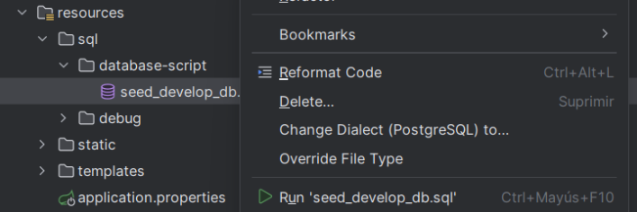
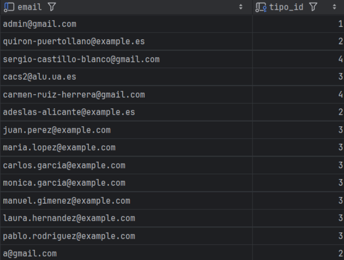

# 🚀 VitalSanity v4.2.0

## 🔥 Levantar el Proyecto usando Docker Compose

Gracias la configuración establecida con Docker Compose, la aplicación puede ejecutarse
desde cualquier ordenador mediante comando:

```sh
docker compose up
```
El único requisito necesario es tener instalado Docker.

## 🔥 Ejecutar la aplicación cargando el perfil de Postgres

Asimismo, la aplicación también puede ser ejecutada mediante los siguientes comandos:

En primer lugar, ejecutar este comando para levantar la base de datos de ‘PostgreSQL‘
en un contenedor de ‘Docker‘

```sh
docker run –name postgres-vitalsanity-develop -e POSTGRES_USER=vital
-e POSTGRES_PASSWORD=vital -e POSTGRES_DB=vital -p 5058:5432 -d
postgres:13
```

A continuación, ejecutar el siguiente comando para arrancar la aplicación cargando el
perfil de PostgreSQL:

```sh
mvn spring-boot:run -D spring-boot.run.profiles=postgres
```

En este caso, para que la aplicación arranque de forma correcta tras la ejecución de estos
dos comandos, es necesario tener instalado lo siguiente:

- JDK 21
- Maven 3.9.9
- Docker

Vemos como en efecto es mucho más cómodo ejecutar directamente la aplicación mediante
docker compose up.

## 🔥 Datos para probar la aplicación

Una vez se haya arrancado la aplicación, hay que ejecutar el fichero de seeders
**seed_develop_db.sql** (este fichero se ejecuta **automáticamente** si se ha levantado la aplicación
con **Docker Compose**)



Finalmente, tras haber ejecutado el fichero de seeders se podrá acceder a la aplicación
cualquiera de los usuarios mostrados en la imagen.




Para todos ellos la contraseña de acceso es **vitalsanity123**.

Asimismo, mencionar que:

- _**tipo_id = 1**_ se corresponde con el tipo de usuario **_’administrador’_**
- **_tipo_id = 2_** se corresponde con el tipo de usuario **_’centro medico’_**
- **_tipo_id = 3_** se corresponde con el tipo de usuario **_’profesional médico’_**
- **_tipo_id = 4_** se corresponde con el tipo de usuario **_’paciente’_**


